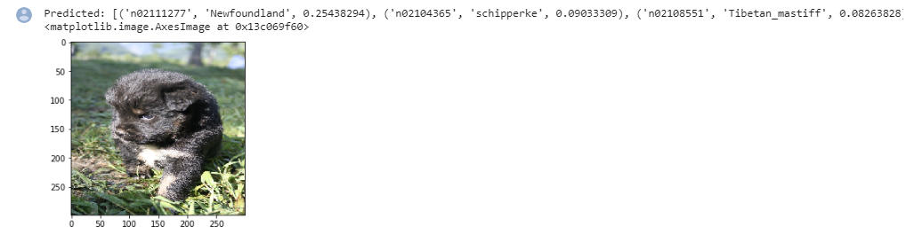
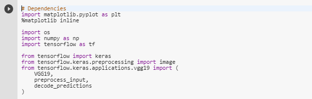
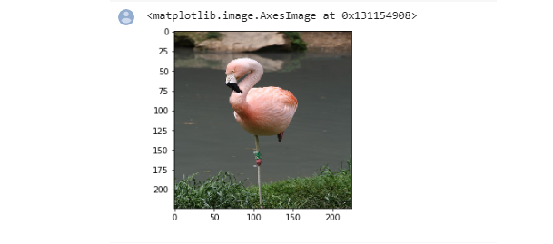
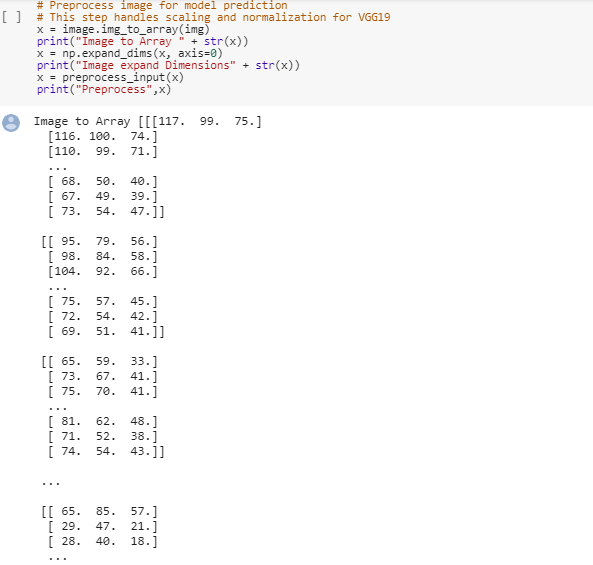
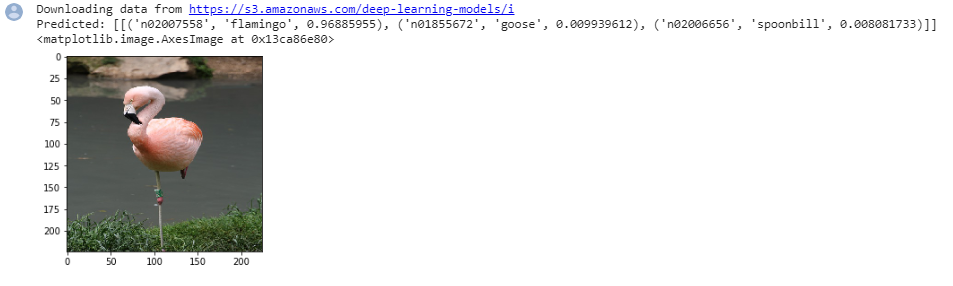
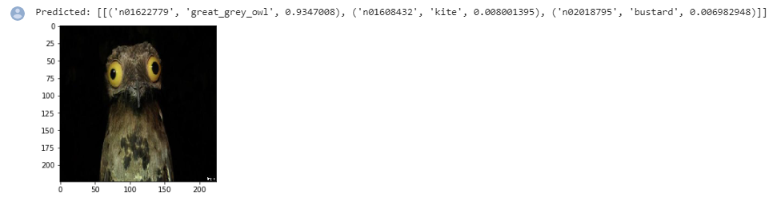
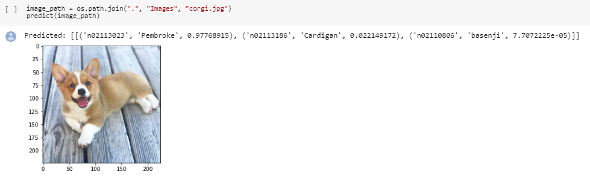
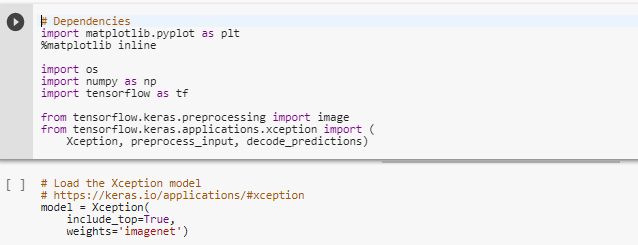
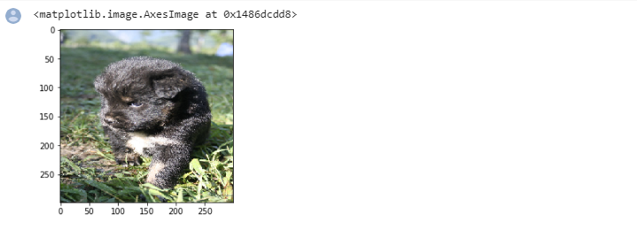

#### Machine Learning - Tensor Flow

# ImageRecognition--ComputerVision

# Background

Practicing using the Tensor-Flow library to Predict animal images.

# Goals

* Import Dependencies
* Load the VGG19 model
* Define default image size for VGG19 and Xception
* Load the image and resize to default image size
* Preprocess image for model prediction
* Handles scaling and normalization for VGG19 and Xception
* Make Predctions
* Refactor above steps into reusable function

# How to run 

Open Google Colab https://colab.research.google.com/
* File
* Upload Notebook
* Run the Cells

# Proccess

Import the data set and visualize the data

* Data set
#  

* Describe the data
#  

Creating 2 variables
* negative, no fraud
* positive, fraud
#  

Visualize the Count of Fraud and NoFraud
* Find out that the data is very unbalanced
#  

Heat Map
#  

Kernel density estimation (KDE) is a non-parametric way to estimate the probability density function of a random variable.
#  

* Re-shaping the values 
* Evaluating the Model
#  

Final Model represented by Confunsion Matrix
#  

Final Model represented by Confunsion Matrix
#  

